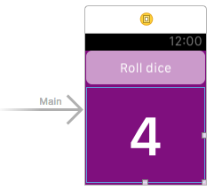
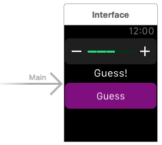

# Swift Learning trail

## 07-08.03.2015 · Apple Watch and Swift

Watched sections 1, 2 and 3 of the [The Complete Apple Watch Developer Course](https://www.udemy.com/complete-apple-watch-developer-course/) and built the elementary projects [Roll a dice](complete-apple-watch-course/section-02/) and [How many fingers?](complete-apple-watch-course/section-03/)

 
